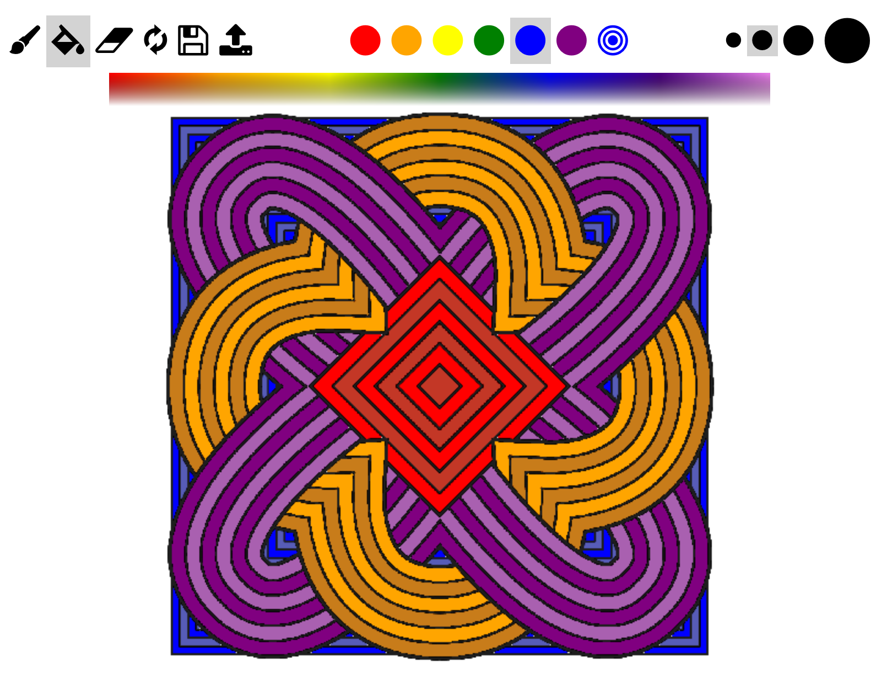
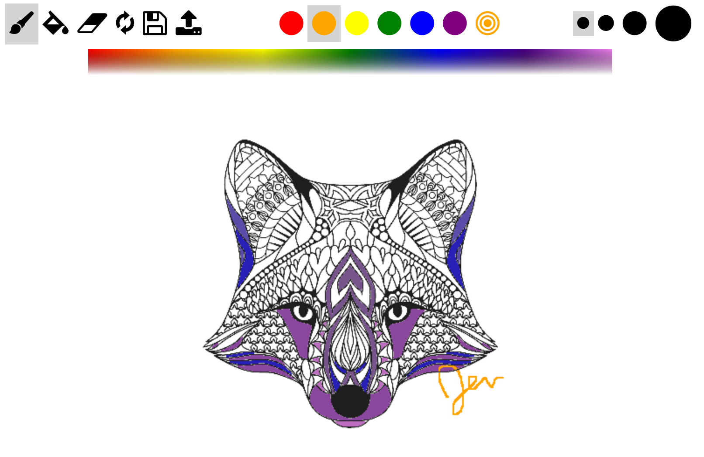
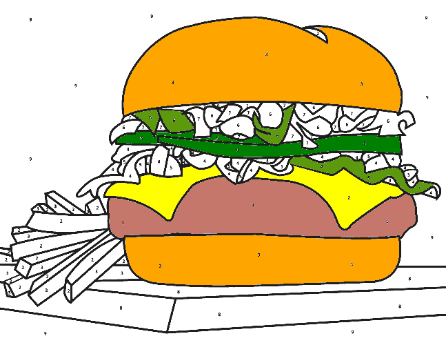
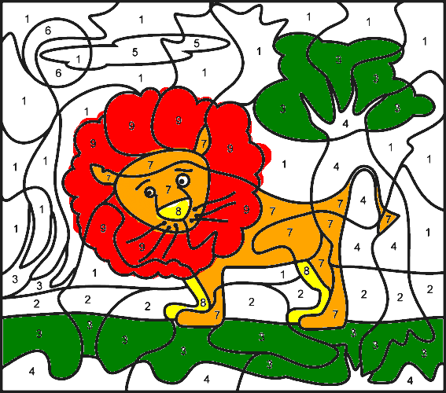

# Online Drawing App

## Demo
[View a live demo](http://colortogether.herokuapp.com/)

## Users can collaboratively color online!
- Includes tools:
  - Paintbrush
    - 4 different size brushes
  - Paint fill
  - Eraser
  - Clear canvas, and
  - Save
  - Upload for custom images
- Includes red, orange, yellow, green, blue, and purple as well as custom colors
- Users can join teammembers on any page
  - Default patterns (pattern1 - pattern10)
  - Any additional URL paths can be used as custom canvases
  - Canvases are reset when all users leave
- Supports mouse and touch events
- Can also be used for coloring, paint-by-number, or as a general whiteboard

## Built using:
- HTML5
  - Canvas
  - Download
- CSS3
  - Flexbox
- Icons
  - Ionicons
  - Font Awesome
- Javascript
  - Jquery
  - Socket.io
  - Express/Node

## Screenshots

## Notes:
- Adapted from this [tutorial](http://www.williammalone.com/articles/create-html5-canvas-javascript-drawing-app/)
- Images are from various places on the internet
